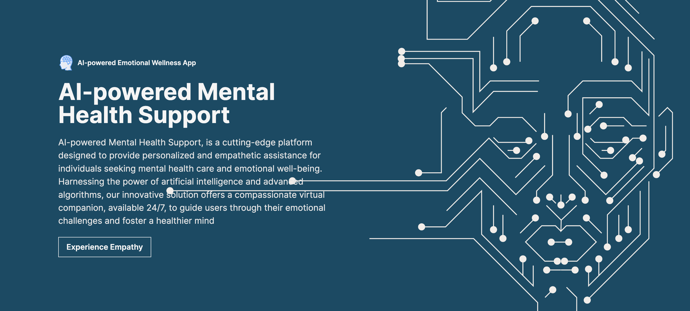

# EmotiCareAI


## Overview 
```emoticare.ai``` is a persistent, fault tolerant and powerful AI-based mental health counseling platform with 3 consistently trained ```Deep Learning Models``` to analyze daily journaling text-sentiment through ```Natural Language Processing```, human mood via real-time facial features detection using ```OpenCV``` open-source framework, and help users express and validate their emotions to the emoticare ```AI-Psychiatrist``` bot. ```RESTAPI``` acts as a bridge between server and model.

## Frontend

### 1. Getting Started
   Prerequisites 
  Before proceeding with the installation, ensure that you have the following prerequisites:

  * Node (v12 or higher)
  * npm
  * Internet connection to fetch dependencies

### 2. Installation
     
  To install the Emoticare.AI web app, follow these steps:
     
  * Clone the repository from the GitHub repository.
  * Navigate to the project directory.
  * Run npm install to install the required dependencies.
  * Running the Web App
    To run the Emoticare.AI web app locally, execute the following command:

    ```
      npm run dev
    ```
  The web app will be accessible at http://localhost:3000.

### 3. Technology Stack for Backend

  * Nextjs - A React Framework
  * Zustand - A state management library
  * Axios
  * Framer Motion
  * React Socket IO - Reall time communication between frontend and backend
  * Tailwind CSS
  * React WebCam


## Backend

### 1. Technology Stack for Frontend

  * Languages: Typescript, Python
  * Tools Used: Flask, Firebase
    
### 2. Features and Source files description
#### User Authentication and Authorization <br>
```./auth/server.ts```runs the server for the user authentication and authorization service. It lets users to register, login, reset password and delete their account. The password is hashed and a token is generated upon registration. The token refreshed after every login. The user credentials are stored in Firebase. <br>

#### Chatbot <br>
```./chatbot/model.ipynb``` is the Deep Learning Model trained with hardcoded ```intents.json```

```./chatbot/server.ts```runs the server for the chatbot service. It is connected to the Flask API using the endpoint ```/chat```. It allows user to conversate with a AI-Psychiatrist bot. <br>

#### Face Emotion Detector <br>
```./face-emotion-detect/emotiAI.ipynb``` is the Deep Learning Model trained with ```./face-emotion-detect/dataset/icml_face_data.csv```. The model and its weights is managed by ```./face-emotion-detect/model.py```The Webcam is operated through OpenCV library integrated in ```./face-emotion-detect/camera.py``` <br>
```./face-emotion-detect/server.ts```runs the server for the facial emotion detector service. It is connected to the Flask API using the endpoint ```/video_feed```. It allows user to conversate with a AI-Psychiatrist bot. <br>

#### Text Journalling <br>
```./nlp/model.py``` is the Natural Language Processing(NLP) model made through Transfer Learning from pre-built model, ```nlptown/bert-base-multilingual-uncased-sentiment```. 
```./nlp/index.ts```runs the server for the NLP service. It is connected to the Flask API using the endpoint ```/sentiment```. It allows user to write their daily journal and get a opinion validating response.

## Datasets Used
* icml_face_data.csv

## Algorithms/Models Used
* nlptown/bert-base-multilingual-uncased-sentiment
* Gradient-Weighted Class Activation Mapping (Grad-CAM)

## Devops
### Tools Used 
* Docker
* Kubernetes

  
## Roadmap for this project:
This is just the first version of the project. We are looking forward to enhance the front-end and improve the accuracy of Deep Learning Model. We also want to add more features and test it in real life world.
